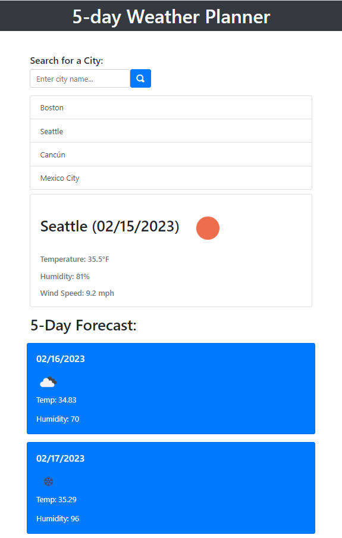

# Project: Module 6 Challenge: 5 Day Weather Planner

## Table of Contents: 
- [Module 4 Challenge: Browser Based Workday Planner](#5-day-weather-planner)
  - [Table of Contents:](#table-of-contents)
  - [License:](#license)
  - [Description:](#description)
  - [Installation Instructions:](#installation-instructions)
  - [Github:](#github)
  - [Images:](#images)
 

## License:
See repository for more license information

## Description:
This application is a 5 day weather planner. This application allows a user to search for a city and the results will give back weather data for 5 days. The data returned includes temperature, humidty, and wind speed, as well as sun events (cloudy, sunny, partly cloudy, etc.) The application also allows the user to store previous searches in the localstorage displaying the search history and allowing the user to click on previous searches to display those results.

## Installation Instructions: 
Launch the site in the browser of your choosing.

## Github: 
Check out my repository and progress in developing skills to become a full stack developer: https://github.com/Tunestring

## Images:

